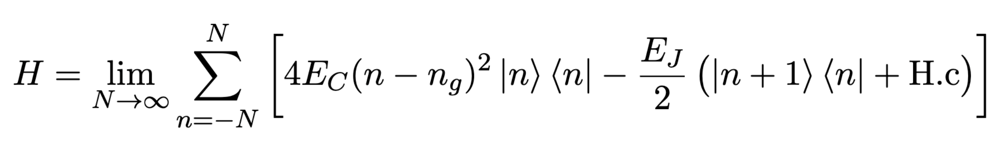
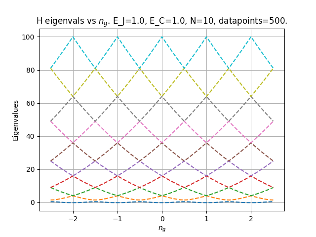
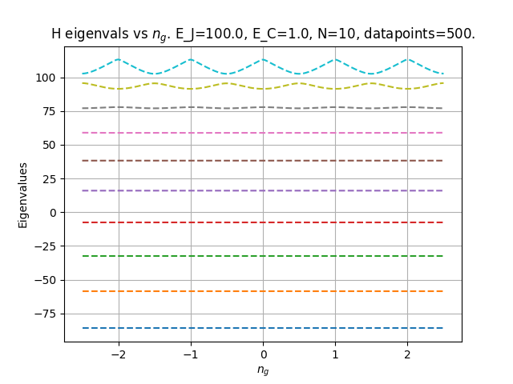

# Chargebasis matrix representation of the Transmon
A common matrix used in modeling superconducting quantum computers is the charge basis 
matrix representation of the transmon. This matrix is defined by the Hamiltonian:



E_C, E_J and n_g are parameters of the matrix.

## Project description
This project implements the Transmon class, representing the
transmon as defined above. The class implements N, E_C, E_J and n_g as instance
variables. 

A Transmon object is able to return its Hamiltonian in the current state defined by the values of N, E_C, E_J and n_g. 
The class is additionally able to return a diagonalized form of the Hamiltonian.

## User guide
1. Choose the values of n (**OBS:** has to be an integer value), e_c, e_j, and n_g.
2. Create an instance of the Transmon class with the chosen values as follows: 
```transmon = Transmon(n = N, e_c = e_c, e_j = e_j, n_g = n_g)```.
3. You can now access the Hamiltonian as matrix as follows: 
```hamiltonian = transmon.h```.
4. To access the diagonalized Hamiltonian you can perform: 
```D = transmon.h_diagonalized```, which will give you the diagonalized matrix in its eigenbasis.
5. You can retrieve the eigenbasis by: ```P = transmon.h_eigenbasis```.
6. Lastly, you can update the instance variables: n, e_c, e_j, and n_g, for e.g. ```transmon.n = new_n``` will update n.
The Hamiltonian will be recomputed automatically.

## Documentation
See the comments in *Transmon.py* for clarifications. Examples of usage are shown in *main.py*, where
we diagonalized the H/E_C matrix and made plots as a function of n_g in [−2.5, 2.5] for
N = 10 and the cases:
1. E_J/E_C = 1
2. E_J/E_C = 10
3. E_J/E_C = 100




Unit tests are provided in *TransmonTest.py*!